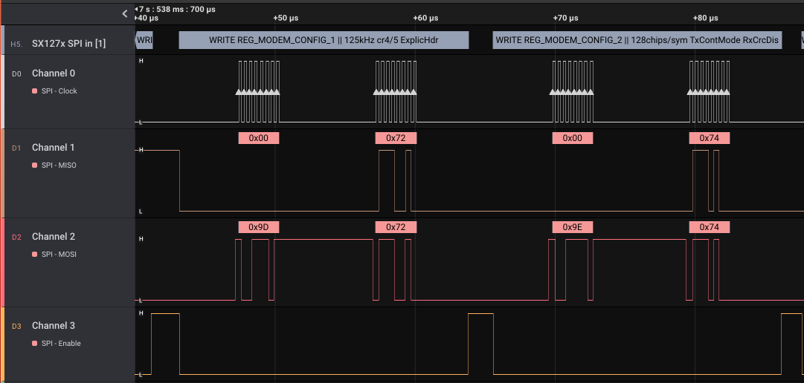

# HLA SX127x in SPI 

High-level-analyzer for Semtech SX127x LoRa transceiver working on top of SPI low-level-analyzer (LLA). Analyzes the SPI traffic in WRITE/READ to/from SX127x.

Tested successfully in Logic2 2.3.55, MacOs.

